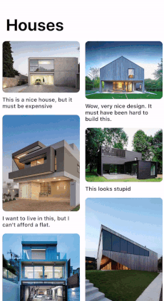

# Pinterest Layout
A custom UICollectionViewLayout subclass that implements a layout used in the Pinterest app. The layout supports the placement of banners that are full sized cells "braking" the waterfall layout.

<p align="center">

</p>

## Usage
### Setup
```swift
pinterestLayout.delegate = self
pinterestLayout.numberOfColumns = 2
pinterestLayout.cellPadding = 6
```
### Register banner
```swift
colView.register(BannerView.self, forSupplementaryViewOfKind: PinterestLayout.elementKindBanner,
                withReuseIdentifier: Constants.bannerID)
```
### Pinterest Layout Delegates
```swift
func collectionView(_ collectionView: UICollectionView, layout: PinterestLayout,
                    heightForItemAtIndexPath indexPath: IndexPath) -> CGFloat {
    // Return the desired cell size
}

func collectionView(_ collectionView: UICollectionView, layout: PinterestLayout,
                    heightForBannerAtIndexPath indexPath: IndexPath) -> CGFloat {
    // Return the height of the banner
}

func numberOfItemsBeforeAds(in collectionView: UICollectionView) -> Int {
    // Specify the frequency of banners
}
```
## Performance
The layout uses binary search to provide the visible cells' layout attributes.

```swift
override func layoutAttributesForElements(in rect: CGRect) -> [UICollectionViewLayoutAttributes]? {
    var result = [UICollectionViewLayoutAttributes]()
    
    let attributes = binSearchAttributes(in: itemCache, intersecting: rect)
    result.append(contentsOf: attributes)
    
    supplementaryCache.keys.forEach { key in
        if let cache = supplementaryCache[key] {
            let attributes = binSearchAttributes(in: cache, intersecting: rect)
            result.append(contentsOf: attributes)
        }
    }
        
    return result
}
```
The supplementary cache is a dictionary in which the key should be the `elementKind` property of supplementary views. With the extension of the layout, other supplementary views could be added easily with the modification of only the prepare method. (see the layout of the banner)
